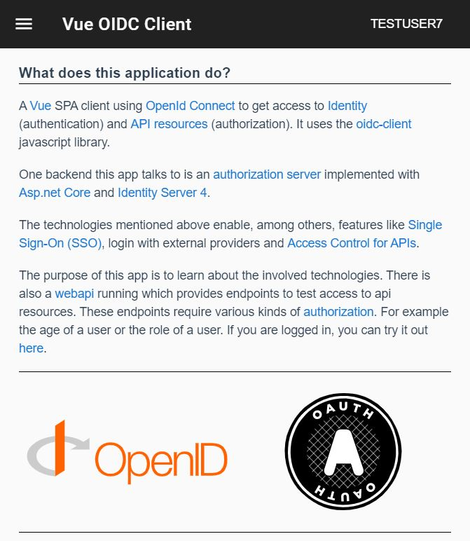

# Vue OIDC Client

A vue spa app to test and learn about using authentication and authorization. It uses the <a href="https://github.com/IdentityModel/oidc-client-js">oidc-client.js</a> library to do so.
To use all the functionality of the app, it should be used together with an <a href="https://github.com/latsic/idServer.git">authentication server</a>.
To test access to api resources, see <a href="https://github.com/latsic/idApi1.git">this repo</a>.

## Built With

* [Vue](https://vuejs.org/) - The web framework used
* [OIDC-Client](https://github.com/IdentityModel/oidc-client-js) - OpenId Connect Client

## Getting Started

### Prerequisites

* [NPM/Node](https://www.npmjs.com/get-npm) - NPM and Node.js

### Installing

## Deployment

## Contributing

## Versioning

## Authors

## License

## Acknowledgments

## Screenshots

  

  

  

